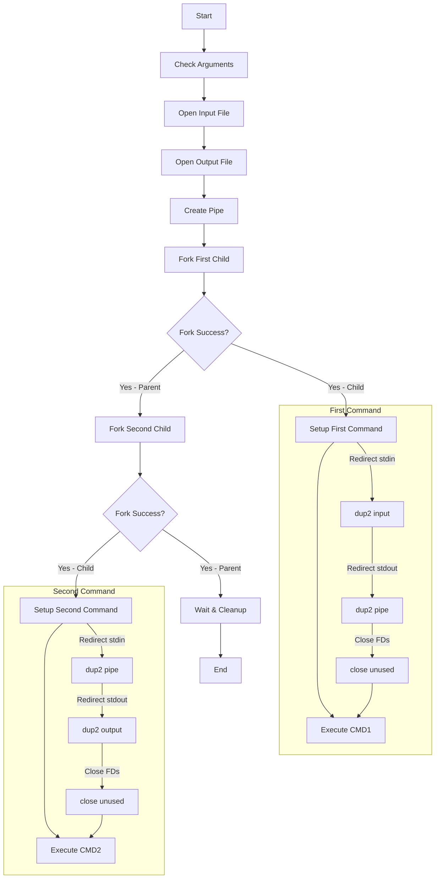

```mermaid
flowchart TD
    A[Start] --> B[Check Arguments]
    B --> C[Open Input File]
    C --> D[Open Output File]
    D --> E[Create Pipe]
    E --> F[Fork First Child]
    F --> G{Fork Success?}
    G -->|Yes - Child| H[Setup First Command]
    G -->|Yes - Parent| I[Fork Second Child]
    I --> J{Fork Success?}
    J -->|Yes - Child| K[Setup Second Command]
    J -->|Yes - Parent|L[Wait & Cleanup]
    H --> M[Execute CMD1]
    K --> N[Execute CMD2]
    L --> O[End]

    subgraph First Command
    H --> |Redirect stdin| H1[dup2 input]
    H1 --> |Redirect stdout| H2[dup2 pipe]
    H2 --> |Close FDs| H3[close unused]
    H3 --> M
    end

    subgraph Second Command
    K --> |Redirect stdin| K1[dup2 pipe]
    K1 --> |Redirect stdout| K2[dup2 output]
    K2 --> |Close FDs| K3[close unused]
    K3 --> N
    end
```
