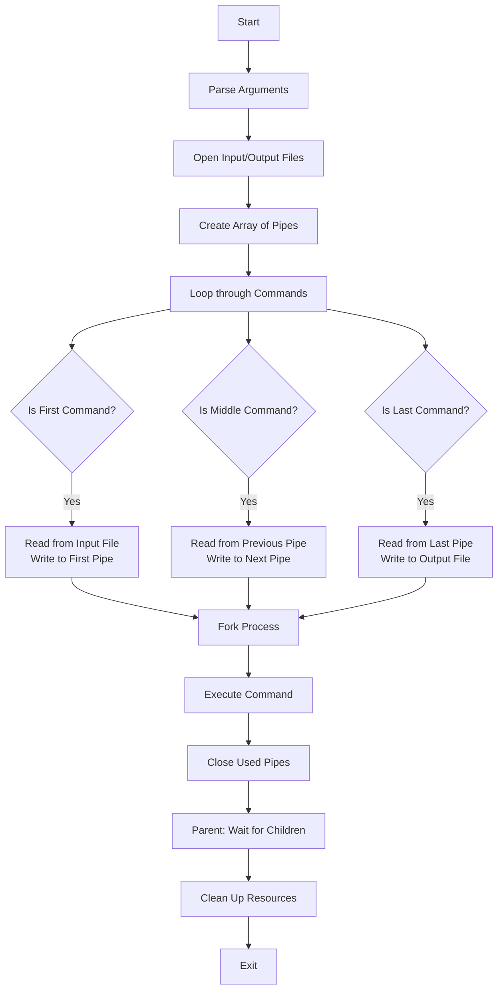

```mermaid
graph TD
    A[Start] --> B[Parse Arguments]
    B --> C[Open Input/Output Files]
    C --> D[Create Array of Pipes]
    D --> E[Loop through Commands]

    E --> F{Is First Command?}
    F -->|Yes| G[Read from Input File<br/>Write to First Pipe]

    E --> H{Is Middle Command?}
    H -->|Yes| I[Read from Previous Pipe<br/>Write to Next Pipe]

    E --> J{Is Last Command?}
    J -->|Yes| K[Read from Last Pipe<br/>Write to Output File]

    G --> L[Fork Process]
    I --> L
    K --> L

    L --> M[Execute Command]
    M --> N[Close Used Pipes]

    N --> O[Parent: Wait for Children]
    O --> P[Clean Up Resources]
    P --> Q[Exit]
```